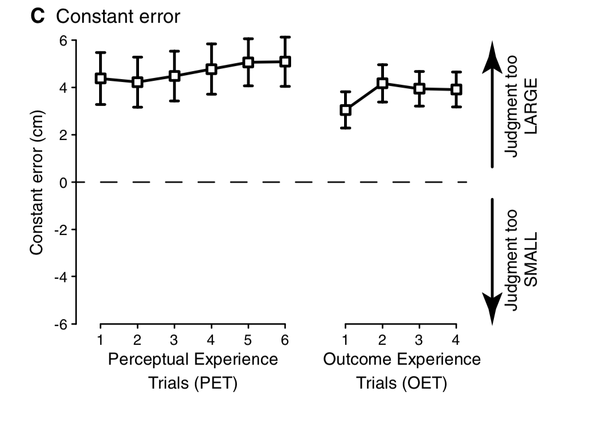
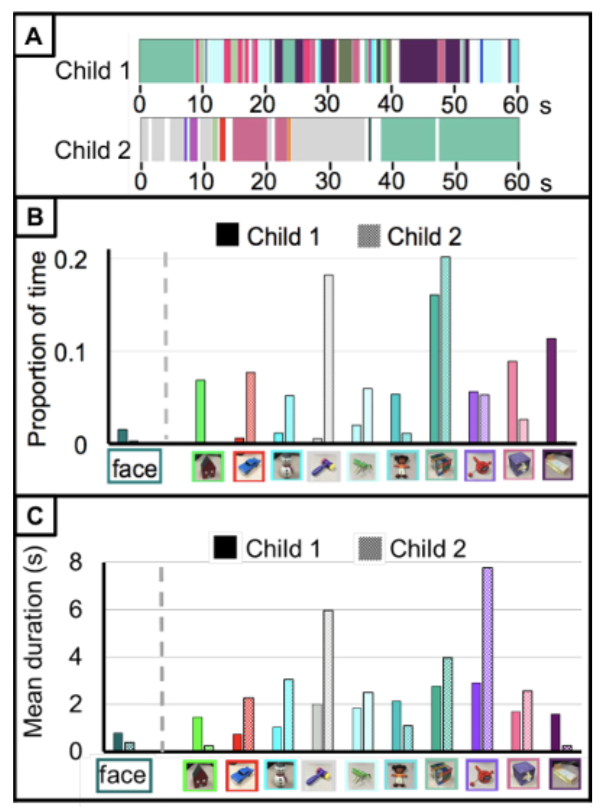
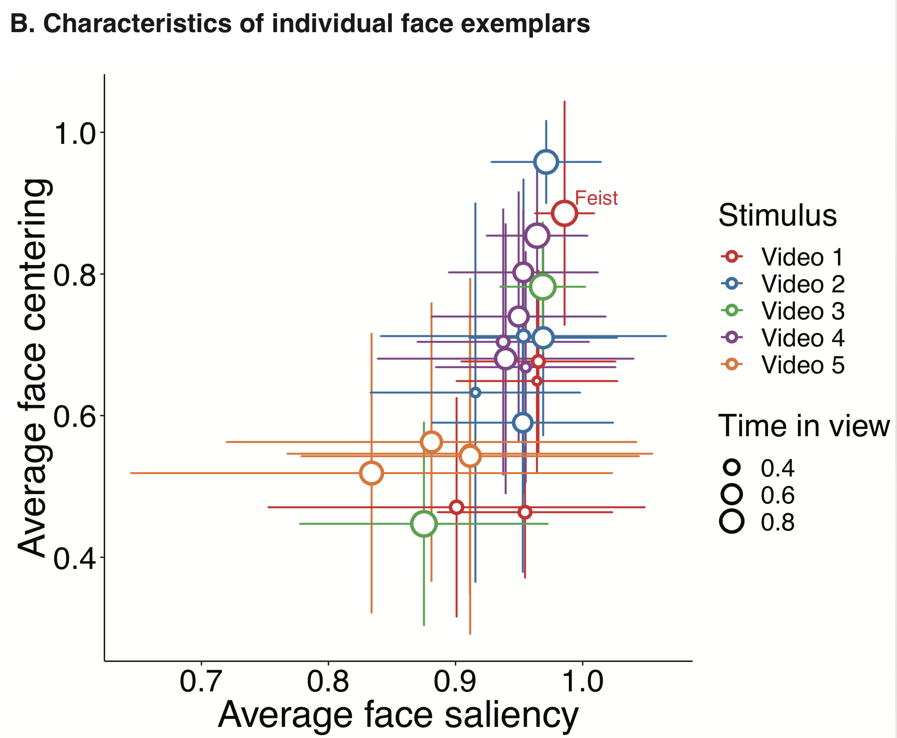
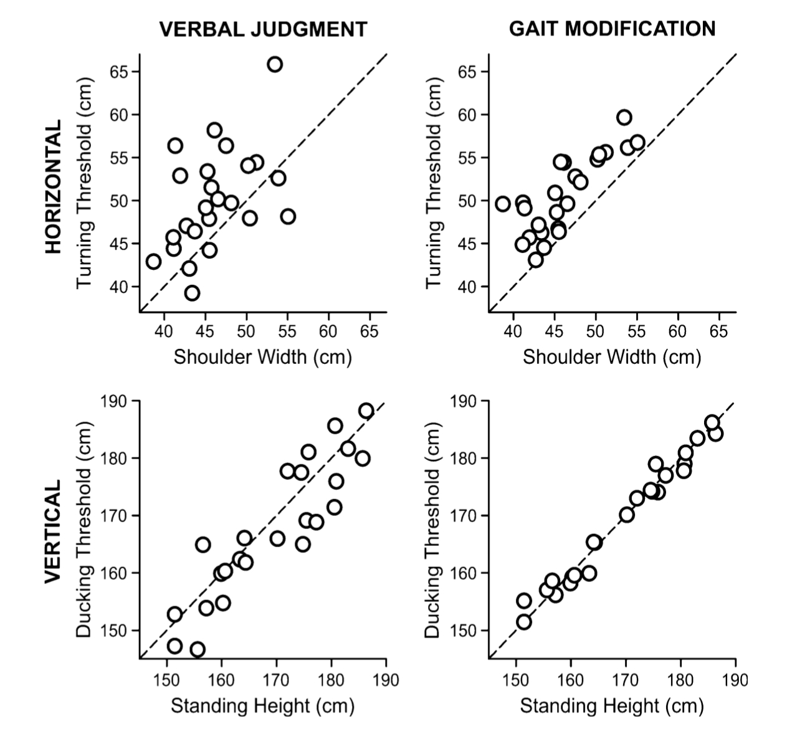
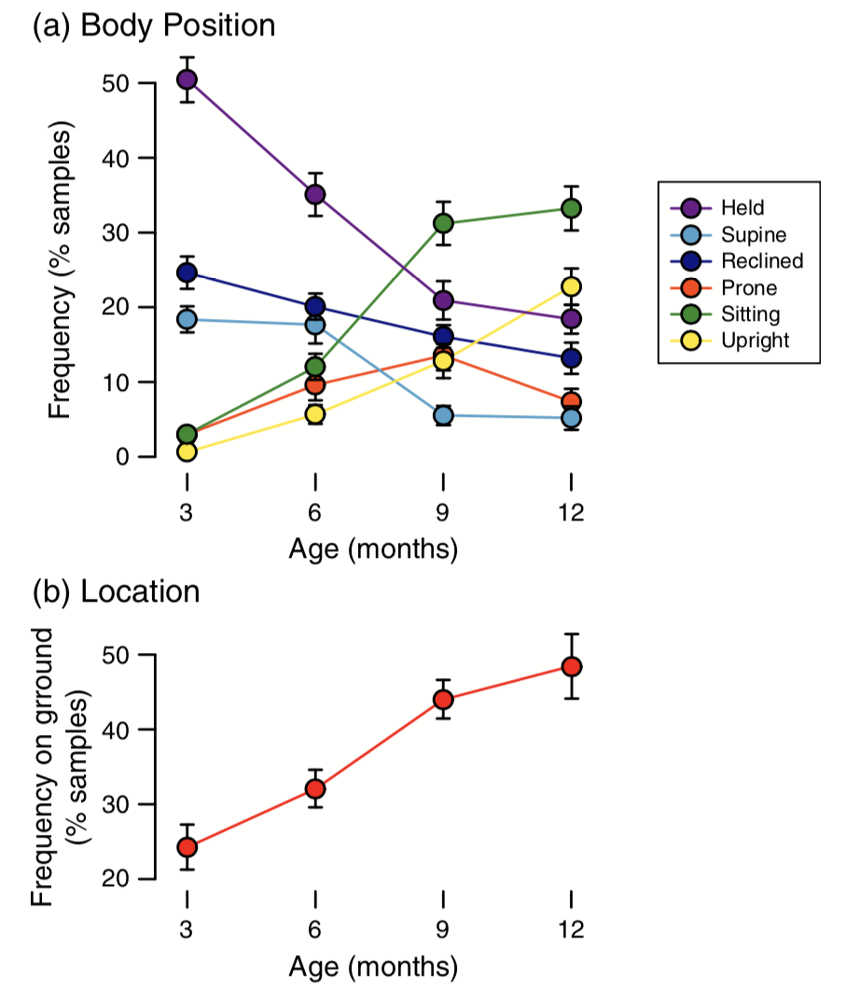
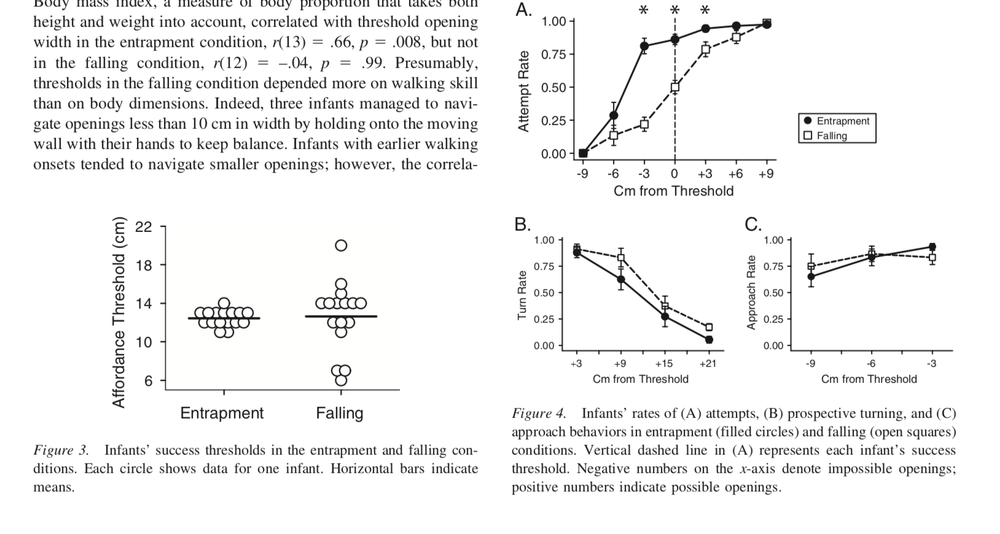
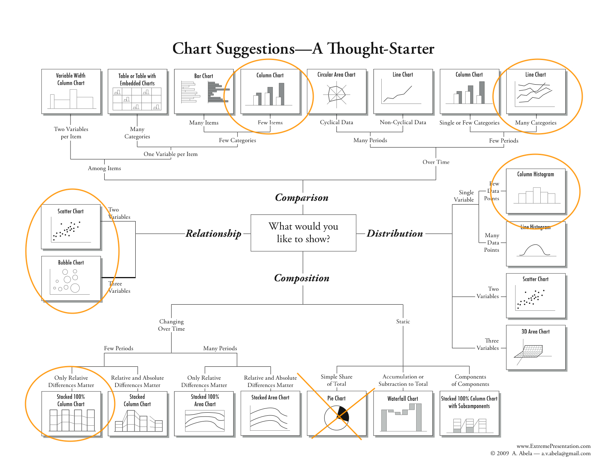
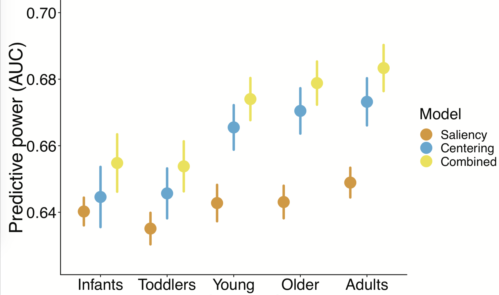
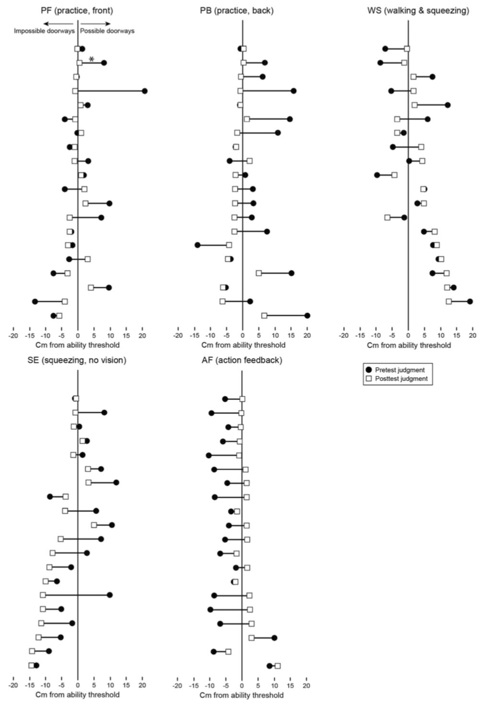
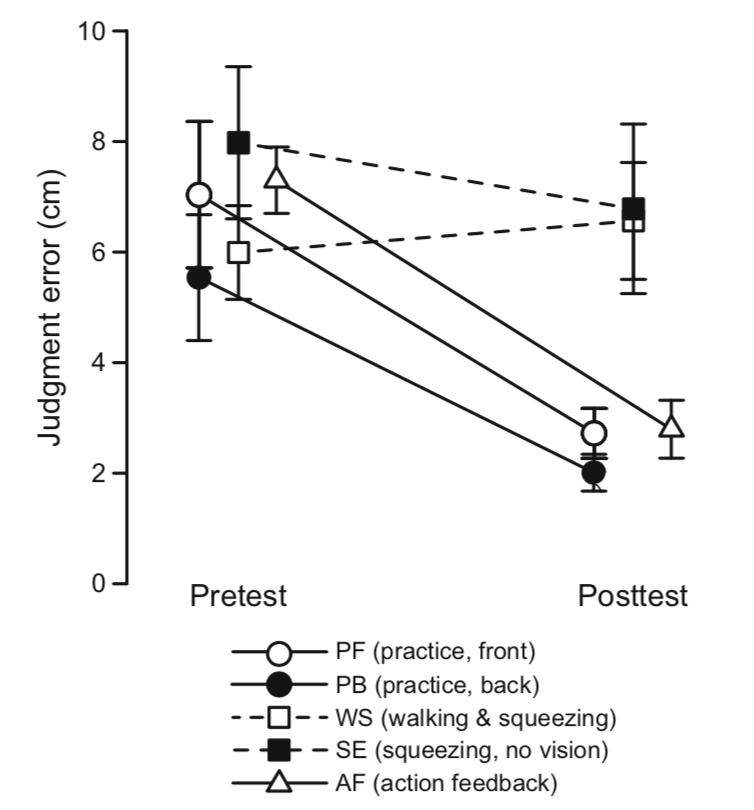

```{r setup, include=FALSE}
knitr::opts_chunk$set(echo = FALSE, warning = FALSE, message = FALSE)

# SET UP --------------
#Install and load packages
pkgs <- c("multcomp", "emmeans", "tidyverse", "effects", "lme4", "lmerTest", "psych","ggforce","knitr")
#lapply(pkgs[!(pkgs %in% installed.packages())], install.packages)
lapply(pkgs, library, character.only = TRUE)

#Set graphics themes and colors
cbp1 <- c("#999999", "#E69F00", "#56B4E9", "#009E73",
          "#F0E442", "#0072B2", "#D55E00", "#CC79A7")
theme_update(text = element_text(size = 18),
      axis.text.x = element_text(size = 18, color = "black"), axis.title.x = element_text(size = 21, margin = margin(t = 0, r = 0, b = 10, l = 0)),
      axis.text.y = element_text(size = 18,  color = "black"), axis.title.y = element_text(size = 21, margin = margin(t = 0, r = 10, b = 0, l = 0)), 
      panel.background = element_blank(),panel.border = element_blank(), panel.grid.major = element_blank(),
      panel.grid.minor = element_blank(), axis.line = element_line(colour = "white"), 
      axis.ticks.length = unit(.25, "cm"), axis.ticks = element_line(size = 1, lineend = "round"),
      legend.key = element_rect(fill = "white"))

# CREATE DATA SET ---------------------------------------------------------------
ds <- read_csv("summary_stats_LSS1.csv", na = "NaN")
ds <- mutate(ds, id = factor(id))
ds[ds["id"] == 13, "search_eyex_speed"] <- NA

# Convert from wide to long format =======
dv_vars <- c("walk_eyex_std","search_eyex_std","walk_eyey_std","search_eyey_std")
iv_vars <- c("id")

ds %>% 
  select(c(iv_vars,dv_vars)) %>% 
  gather(key = "cond", value = "std", dv_vars) -> dsl

dsl$dim <- factor(ifelse(is.na(str_extract(dsl$cond,"x")),"y","x"))
dsl$task <- factor(ifelse(is.na(str_extract(dsl$cond,"walk")),"search","walk"),levels = c("walk","search"),labels = c("Walk","Search"))

ds_sum <-  dsl %>% group_by(dim, task) %>% 
  summarise(stdev = mean(std, na.rm = T), n = n(), se = sd(std, na.rm = T)/sqrt(n), ymin = stdev - se, ymax = stdev + se) 
```
# Outline
- What makes a good graph? 
- What makes a good series of graphs? 
- What graphical elements are appropriate for different types of data? 

# Making effective visualizations
- What makes a good graph?

# Graph from last time 
- What makes this a good graph? 
- What makes this a bad graph?

```{r, out.height='70%',fig.asp = 1,fig.align='center'}
ggplot() + 
  geom_sina(data = dsl, aes(y = std, x = dim, color = task), maxwidth = .5, position = position_dodge(.6), alpha = .5, size = 3) +
  geom_errorbar(data = ds_sum, aes(x = dim, group = task,ymin = ymin, ymax = ymax), size =1, width = .3, position = position_dodge(.6)) +
  scale_color_manual(values = cbp1[c(7,6)], name = "Task") + 
  scale_y_continuous(breaks = seq(0,20,5), limits = c(0,20)) + 
  labs(x = "", y = "Position SD (º)") 
```

# Making effective visualizations
## What makes a good graph?
  * Highlights the most important information
  * Reduces visual clutter (remove unnecessary backgrounds, lines, etc)
  * Clear, legible elements (text is big enough, colors/shapes are distinguishable)
  * Graphical elements map onto conceptual elements (graph mean +/- SE if showing inferential statistics, don't show min/max if it's not relevant)
  * Graph does not mislead the audience (sensible axes, doesn't hide individual data/variability)
  * Scaffolds for interpreting figure (annotations, reference lines, scales)
  
# How about this one?

```{r, out.height='70%', fig.asp = 1, fig.align='center'}
ggplot() + 
  #geom_sina(data = dsl, aes(y = std, x = dim, color = task), maxwidth = .5, position = position_dodge(.6), alpha = .5, size = 3) +
  geom_errorbar(data = ds_sum, aes(x = dim, group = task,ymin = ymin, ymax = ymax,color = task), size =1, width = .3, position = position_dodge(.6)) +
  scale_color_manual(values = cbp1[c(7,6)], name = "Task") + 
  scale_y_continuous(breaks = seq(9,13,.5), limits = c(9,13.5)) + 
  labs(x = "", y = "Position SD (º)") 
```

# How about this one?

```{r, out.height='70%', fig.asp = 1,fig.align='center'}
ggplot() + 
  #geom_sina(data = dsl, aes(y = std, x = dim, color = task), maxwidth = .5, position = position_dodge(.6), alpha = .5, size = 3) +
  geom_errorbar(data = ds_sum, aes(x = dim, group = task,ymin = ymin, ymax = ymax, color = task), size =1, width = .3, position = position_dodge(.1)) +
  scale_color_manual(values = cbp1[c(7,6)], name = "Task") + 
  scale_y_continuous(breaks = seq(0,15,5), limits = c(0,15)) + 
  labs(x = "Dimension", y = "Position SD (º)") 
```

# How about this one?

```{r, out.height='70%', fig.asp = 1,fig.align='center', echo=FALSE, warning=FALSE}
ggplot(data = dsl, aes(x = dim, y = std, color = task)) + 
  geom_boxplot(size =1, width = .3) +
  scale_color_manual(values = cbp1[c(7,6)], name = "Task") + 
  #scale_y_continuous(breaks = seq(0,15,5), limits = c(0,15)) + 
  labs(x = "Dimension", y = "Position SD (º)") 
```

# How about this one?

```{r, out.height='70%', fig.asp = 1,fig.align='center'}
library(quantmod)
data("economics", package = "ggplot2")

# Compute % Returns
economics$returns_perc <- c(0, diff(economics$psavert)/economics$psavert[-length(economics$psavert)])

# Create break points and labels for axis ticks
brks <- economics$date[seq(1, length(economics$date), 12)]
lbls <- lubridate::year(economics$date[seq(1, length(economics$date), 12)])

# Plot
ggplot(economics[1:100, ], aes(date, returns_perc)) + 
  geom_area() + 
  scale_x_date(breaks=brks, labels=lbls) + 
  theme(axis.text.x = element_text(angle=90)) + 
  labs(title="Area Chart", 
       subtitle = "Perc Returns for Personal Savings", 
       y="% Returns for Personal savings", 
       caption="Source: economics")
```

# How about this one?
```{r  out.height = "70%", fig.align="center"}
 
```

# How about this one?
```{r  out.height = "70%", fig.align="center"}
 
```

# How about this one?
```{r  out.height = "70%", fig.align="center"}
 
```

# Making effective sets of visualizations 
- What makes a good series of graphs in a paper?

# Making effective sets of visualizations 
## What makes a good series of graphs in a paper?
  - Consistent scaling across graphs
  - Same mappings for shape/color/line styles across graphs
  - Consistent graphical styles (font sizes, line weights, capitalization, etc)
  
# How about this one?
```{r  out.height = "70%", fig.align="center"}
 
```

# How about this one?
```{r  out.height = "70%", fig.align="center"}
 
```

# How about this one?
```{r  out.height = "70%", fig.align="center"}
 
```
  
# What graphical elements are appropriate for different types of data? 
```{r  out.height = "80%", fig.align="center"}
include_graphics("choosing_graphs.jpg") 
```

# What graphical elements are appropriate for different types of data? 
```{r  out.height = "80%", fig.align="center"}
 
```

# What graphical elements are appropriate for different types of data? 
* Relationship
  * Scatterplot = continous variables, at least 4-5 levels each
  * Be careful of misleading axes scales (like this example)
```{r out.height = "50%", fig.align="center"}
# load package and data
data(mpg, package="ggplot2")
# mpg <- read.csv("http://goo.gl/uEeRGu")

# Scatterplot
theme_set(theme_bw())  # pre-set the bw theme.
g <- ggplot(mpg, aes(cty, hwy))
g + geom_jitter(width = .5, size=1) +
  labs(subtitle="mpg: city vs highway mileage", 
       y="hwy", 
       x="cty", 
       title="Jittered Points")
```
Following examples from:
* http://r-statistics.co/Top50-Ggplot2-Visualizations-MasterList-R-Code.html

# What graphical elements are appropriate for different types of data? 
* Relationship 
 * Use other aesthetics -- size, color, lines -- to represent subgroups
 
```{r out.height = "50%", fig.align="center"}
data(mpg, package="ggplot2")
# mpg <- read.csv("http://goo.gl/uEeRGu")

mpg_select <- mpg[mpg$manufacturer %in% c("audi", "ford", "honda", "hyundai"), ]

# Scatterplot
theme_set(theme_bw())  # pre-set the bw theme.
g <- ggplot(mpg_select, aes(displ, cty)) + 
  labs(subtitle="mpg: Displacement vs City Mileage",
       title="Bubble chart")

g + geom_jitter(aes(col=manufacturer, size=hwy)) + 
  geom_smooth(aes(col=manufacturer), method="lm", se=F)

``` 

# What graphical elements are appropriate for comparisons?
* Comparison
  * Bar/column chart, line and scatter, point range, boxplot 
  * When to use a line vs bar?
  
# What graphical elements are appropriate for comparisons?
* Comparison
  * Bar, point range typically means between-subject data
  * Line typically means w/in subject data (data over time/treatments)
  * Point range is a better stand in for a bar chart (why?)?

```{r  out.height = "50%", fig.align="center"}
 
```

# Bar graphs should always include 0...oops
```{r  out.height = "80%", fig.align="center"}
library(patchwork)
ggplot() + 
  geom_bar(data = ds_sum, aes(x = dim, fill = task,y = stdev), stat = "identity", position = "dodge") +
  scale_fill_manual(values = cbp1[c(7,6)], name = "Task") + 
  scale_y_continuous(breaks = seq(0,20,5), limits = c(0,20)) + theme(legend.position = "top") +
  labs(x = "", y = "Position SD (º)") -> p1

ggplot() + 
  geom_bar(data = ds_sum, aes(x = dim, fill = task,y = stdev), stat = "identity",position = "dodge") +
  scale_fill_manual(values = cbp1[c(7,6)], name = "Task") + 
  coord_cartesian(ylim = c(5,15)) + theme(legend.position = "top") +
  labs(x = "", y = "Position SD (º)") -> p2

ggplot() + 
  geom_pointrange(data = ds_sum, aes(x = dim, color = task,y = stdev, ymin = ymin, ymax = ymax), position = "dodge") +
  scale_color_manual(values = cbp1[c(7,6)], name = "Task") + 
  scale_y_continuous(breaks = seq(0,20,5), limits = c(0,20)) + theme(legend.position = "none") +
  labs(x = "", y = "Position SD (º)") -> p3

ggplot() + 
  geom_pointrange(data = ds_sum, aes(x = dim, color = task,y = stdev, ymin = ymin, ymax = ymax), position = "dodge") +
  scale_color_manual(values = cbp1[c(7,6)], name = "Task") + 
  coord_cartesian(ylim = c(8,14)) + theme(legend.position = "none") +
  labs(x = "", y = "Position SD (º)")  -> p4


(p1 + p2)/(p3 + p4)
```

# Representing error/distribution in comparison graphs 
## What are the pros/cons of including individual data? 
 * Pros?
 * Cons?
 
# Representing error/distribution in comparison graphs 
## What are the pros/cons of including individual data? 
 * Pros?
    * Most transparent
    * Shows distribution, not just mean/sd
 * Cons?
    * Does not always highlight the comparison
    * Raises questions about semi-outliers, influential points
    * Not always possible if there's a lot of data

# Plotting individuals
```{r  out.height = "80%", fig.align="center"}
 
```

# Plotting groups 
```{r  out.height = "80%", fig.align="center"}
 
```